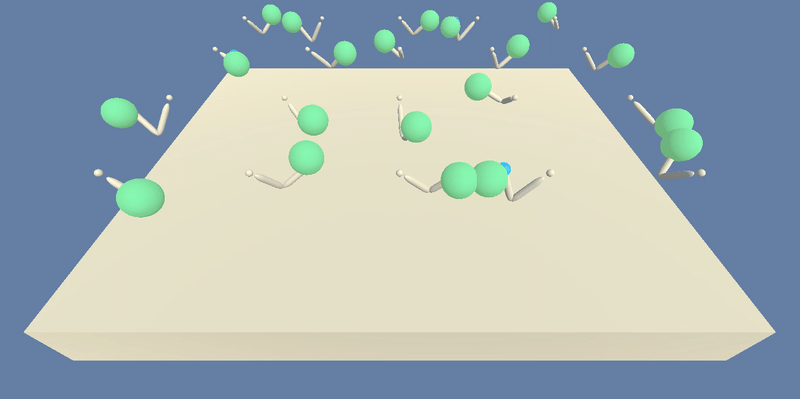

# Deep Deterministic Policy Gradient: Training Agents in Continuous Action Space

Among the most exciting applications for Deep Reinforcement Learning is the implementation of intelligent robotics to carry out the execution of processes normally meant for humans.  One of the largest difficulties in this pursuit remains the complexity of real world environments and training the agent's appropriate interaction with it in order to solve intricate problems.  The Deep Deterministic Policy Gradient (DDPG) algorithm provides a highly effective solution to real world reinforcement learning problems dealing with continuous action spaces.  Built on a deterministic policy gradient algorithm which optimizes a policy based on cumulative reward, DDPG also utilizes experience replay as well as local and target networks for stabilized learning from Deep Q Network methodology.

## Details

The aim of the above implementation is to convey how Deep Reinforcement Learning may be utilized in training multiagent behavior.  As simulations of robotic arms, agents are trained on their ability to remain inside of a desired location for as long as possible.

This implementation utilizes the power of Actor-Critic networks which optimize a policy and value-based method simultaneously.  While the Actor network is in charge of choosing the best action based on optimizing policy, the Critic then evaluates this prediction based on estimated value and suggests improvements to the Actor network.  Further optimization of training is realized through experience replay, where learning is initiated based on past experiences and their outcomes, as well as the use of Gaussian noise in order to reduce generalization error in action predictions.

In the environment, states consist of `33` continuous variables that correspond to position, rotation, velocity and angular velocities of each arm.  Each action is a vector of `4` numbers between -1 and 1 that correspond to the torque applied to two joints.  A reward of `+0.1` is gained from each timestep where an agent is able to remain in the goal location designated by each of the colored spheres below.  The environment is considered solved once the agents realize an average score of `+30` over the last 100 episodes.

 

  
  &nbsp;&nbsp;&nbsp;
  

 

## Results
In the `saved_files` directory, you may find the saved model weights and learning curve plot for the successful Actor-Critic networks.  The trained agents, which you can see operating in the GIF above on the right, were able to solve the environment within 70 episodes, well before the 100 episode evaluation window was even completed, utilizing the DDPG training algorithm.  The graph below depicts the agents' performance over time in terms of relative score averaged over the current and all previously evaluated episodes.

 

  

 

## Dependencies
In order to run the above code, you will have to set up and activate a customized Python 3.6 environment.  Please follow the directions [here](https://github.com/udacity/deep-reinforcement-learning#dependencies) for setup instructions.

Next, please click the link corresponding to your operating system below which will download the respective UnityEnvironment.  You may then save the resulting file directly inside of your cloned repository in order to run the code.
* [Linux](https://s3-us-west-1.amazonaws.com/udacity-drlnd/P2/Reacher/Reacher_Linux.zip)
* [Mac OSX](https://s3-us-west-1.amazonaws.com/udacity-drlnd/P2/Reacher/Reacher.app.zip)
* [Windows (64-bit)](https://s3-us-west-1.amazonaws.com/udacity-drlnd/P2/Reacher/Reacher_Windows_x86_64.zip)

## Train an Agent
All of the relevant functionality and tools you will need in order to initialize and train the agents are available in this repository.  Please utilize the `run_reacher_main.py` file in order to run the training process.  If you would like to change any parameters to personally customize training, please update the relevant attributes in the function calls below the `if __name__ == '__main__':` block.
